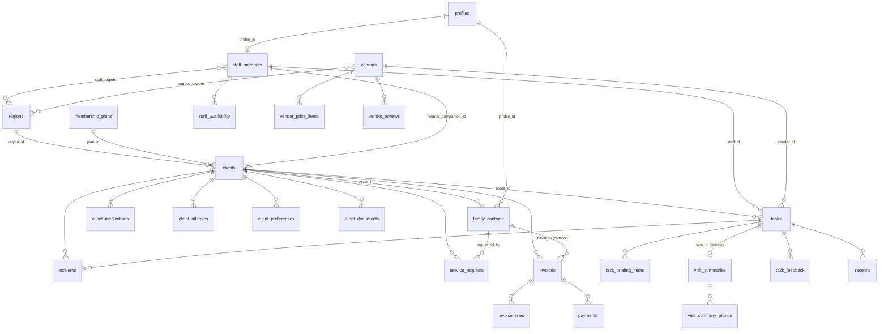

# Database

Run **`full_setup.sql`** once in Supabase → SQL Editor (it is `migrations/0001…0007` + `seed_reference.sql` concatenated).
Optional demo data: **`seed_demo.sql`**. After changing a migration, rebuild the combined file:

```bash
cat migrations/*.sql > full_setup.sql && printf '\n-- ---- reference data ----\n' >> full_setup.sql && cat seed_reference.sql >> full_setup.sql
```

## Making yourself admin

1. Authentication → Users → Add user (tick Auto Confirm).
2. SQL Editor:
   ```sql
   insert into public.profiles (id, role, full_name)
   select id, 'admin', 'אלון' from auth.users where email = 'you@example.com';
   ```

Roles: `admin` (everything), `companion` (link the login with `staff_members.profile_id`), `family` (link with `family_contacts.profile_id`).

## Entity map



## Rules enforced by the database

- A **frozen vendor** (licence or insurance expired, or switched off) cannot be assigned to a task (trigger `tasks_block_frozen_vendor`).
- One **orderer** (מזמין/ת השירות) per client; one invoice per client per month; invoice month must be the 1st.
- A task with no `staff_id` and no `vendor_id` is "ללא שיבוץ"; a receipt with no client and no task is "ממתינה לשיוך".
- **Visit summaries**: companions can only write `draft` / `pending_approval`; `approved` / `sent` stamp their timestamps automatically; families see only `approved` / `sent`.
- Companions check in/out through `check_in(task)` / `check_out(task)`, never by updating tasks directly.
- Trial period = `clients.trial_ends_on` in the future.
- Prices and rates (wage 70, factor 1.3, 10% fees, 300/250 escort) live in the single-row `pricing_settings`.

## Security

RLS is on for every table, anonymous access is revoked, and views use `security_invoker`. Storage buckets `client-documents`, `visit-photos`, `receipts` are private and admin-only for now.
