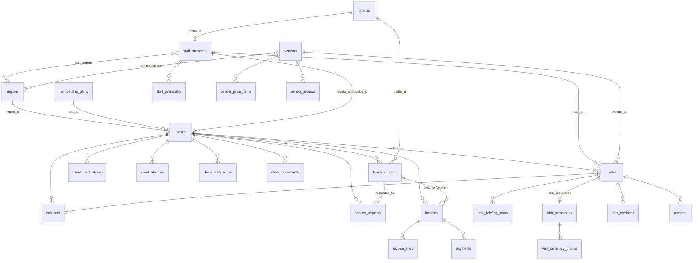

# Database

Which file to run:

| Situation | Run |
|---|---|
| New empty project | `full_setup.sql` (all migrations + reference data), then optionally `seed_demo.sql` |
| Already ran `full_setup.sql` before the notes/scheduling work | `upgrade_0008_to_0012.sql` (once) |
| Refresh the demo data (dates are relative to today) | `reset_and_seed.sql` — **deletes** clients, staff, vendors, tasks, etc. |

When copying a file to the clipboard on macOS use `LANG=en_US.UTF-8 pbcopy < file.sql`; without it Hebrew text is corrupted.
The app tolerates migrations that have not been run yet (those features just show empty), but the new screens need them.
After changing a migration, rebuild the combined file:

```bash
cat migrations/*.sql > full_setup.sql && printf '\n-- ---- reference data ----\n' >> full_setup.sql && cat seed_reference.sql >> full_setup.sql
```

## Making yourself admin

1. Authentication → Users → Add user (tick Auto Confirm).
2. SQL Editor:
   ```sql
   insert into public.profiles (id, role, full_name)
   select id, 'admin', 'אלון' from auth.users where email = 'you@example.com';
   ```

Roles: `admin` (everything), `companion`, `family` (link with `family_contacts.profile_id`; not built yet).

**Companion logins:** create the user in Authentication → Add user (Auto Confirm), then in the app open Staff → edit the companion → enter that email under "אימייל להתחברות לאפליקציה". No SQL needed. The companion then lands on `/companion` after signing in.

## Entity map



## Rules enforced by the database

- A **frozen vendor** (licence or insurance expired, or switched off) cannot be assigned to a task (trigger `tasks_block_frozen_vendor`).
- One **orderer** (מזמין/ת השירות) per client; one invoice per client per month; invoice month must be the 1st.
- A task with no `staff_id` and no `vendor_id` is "ללא שיבוץ"; a receipt with no client and no task is "ממתינה לשיוך".
- **Visit summaries**: companions can only write `draft` / `pending_approval`; `approved` / `sent` stamp their timestamps automatically; families see only `approved` / `sent`.
- Companions check in/out through `check_in(task)` / `check_out(task)`, never by updating tasks directly.
- Trial period = `clients.trial_ends_on` in the future.
- Prices and rates (wage 70, factor 1.3, 10% fees, 300/250 escort, overtime grace 15 min) live in the single-row `pricing_settings`.
- **Recurring visits:** `client_visit_slots` (weekday, hours, purpose, companion). `generate_tasks_from_slots()` creates the visits for the next 30 days (idempotent; the app calls it whenever an admin opens it, and `pg_cron` runs it nightly if the extension is available). Deleting a generated future visit is remembered (`slot_skips`); editing a slot updates future planned visits whose fields were not changed by hand.
- **Payroll** uses actual hours (check-in to check-out) x hourly wage, plus travel per worked day, plus approved `staff_expenses`.
- **Overtime:** a visit that runs longer than planned by more than the grace period can be billed to the client (`decide_visit_overtime`, adds an invoice line) or waived. The companion is paid for actual hours either way.
- **Office planning board:** `coordination_items` (transport, tickets, contractor, doctor ...) with status and the office person handling it.
- Billing fields (card, budget cap) live in admin-only `client_billing`, so companions never see them.

## Security

RLS is on for every table, anonymous access is revoked, and views use `security_invoker`. Storage buckets `client-documents`, `visit-photos`, `receipts` are private and admin-only for now.
